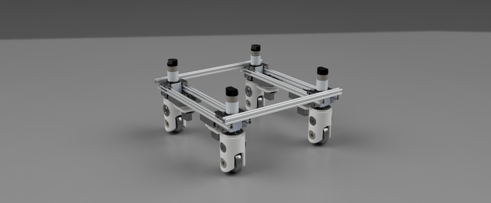
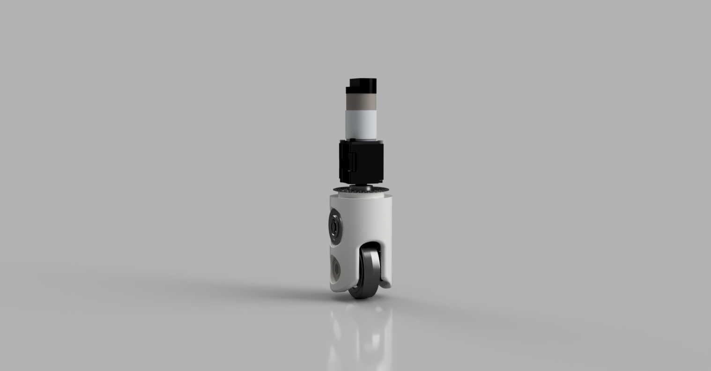

# Print Swerve: A fully customizable, Fully 3D printable Swerve drive for FTC 

This is a fully 3d printable swerve drive developed and used by FTC team [Robocracy](http://www.ftcrobocracy.org) in the 2018 FTC searon. It was primarily developed by [Nicolas Eichenberger](https://sites.google.com/view/neichenberger/) and [Zachary Eichenberger](https://github.com/ZachEichen).

As an FTC team we always strive to push the competition to the next level. We spent over a year developing our very own swerve drive to be a viable FTC drive base. 
After so much time and effort spent in development, we have developed the very first fully 3D printable swerve drive viable for FTC. Finally we have gotten this competition tested design to a stage of completion. 
Therefore, we are releasing this design for the benefit of the FTC community, and anyone else interested in an interesting omnidirectional robot drivetrain. 

## Using this repository: 

Both STL files for printing, and full CAD assemblies are avaliable for convenience. I have exported these in a variety of common CAD file formats in `CAD_source` (although they were made in fusion 360 so they might be a little wonky). 

Two STL files of the main module are avaliable. Our assembly guide assumes the use of 1/2" flanged thunderhex bearings from Vexpro. To use this part, print `STL_files/ModuleBody.stl`. Otherwise, you can use radial thunderHex bearings, and substitute `Tube_Body_Radial_Bearings.stl`.

You can also have a look at the associated thingiverse part, [found here](https://www.thingiverse.com/thing:2998874/files), and Nicky's [blog post](https://sites.google.com/view/neichenberger/projects/robotics-projects/swerve-drive-saga)  on the build process. 

## Glamour shots 

<video controls>
  <source src="images/publicSwerveAssemblyExample.mp4" type="video/mp4">
</video>

